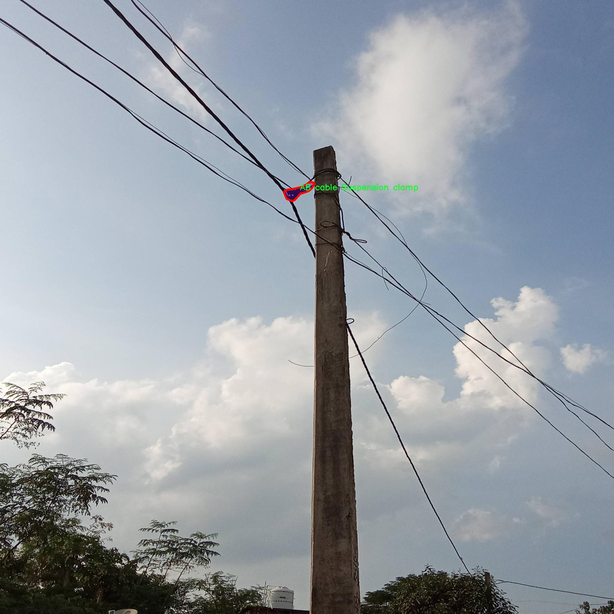

# 低压绝缘子类型分割系统： yolov8-seg-slimneck

### 1.研究背景与意义

[参考博客](https://gitee.com/YOLOv8_YOLOv11_Segmentation_Studio/projects)

[博客来源](https://kdocs.cn/l/cszuIiCKVNis)

研究背景与意义

随着电力系统的不断发展和城市化进程的加快，低压绝缘子在电力传输和配电网络中扮演着至关重要的角色。低压绝缘子不仅是电力设备的重要组成部分，还直接影响到电力系统的安全性和稳定性。因此，准确识别和分类不同类型的低压绝缘子，对于维护电力设施的正常运行、提高电力供应的可靠性具有重要的现实意义。然而，传统的人工检测方法不仅耗时耗力，而且容易受到人为因素的影响，导致识别准确率低下。因此，开发一种高效、准确的低压绝缘子类型分割系统，成为了电力行业亟待解决的技术难题。

近年来，深度学习技术的迅猛发展为图像识别和分割任务提供了新的解决方案。YOLO（You Only Look Once）系列模型因其高效的实时检测能力而受到广泛关注。YOLOv8作为该系列的最新版本，具备了更强的特征提取能力和更高的检测精度。基于YOLOv8的低压绝缘子类型分割系统，能够在复杂的电力环境中，快速、准确地识别和分类不同类型的低压绝缘子，从而为电力设备的维护和管理提供有力支持。

本研究将基于一个包含1200张图像的低压绝缘子数据集进行模型训练和测试。该数据集涵盖了四类低压绝缘子：AB电缆死端夹、AB电缆悬挂夹、针和吊环。这些类别的选择，充分考虑了低压绝缘子在实际应用中的多样性和复杂性。通过对这些图像进行实例分割，研究将能够实现对每种绝缘子类型的精确定位和分类，从而为后续的自动化检测和维护提供数据支持。

本研究的意义不仅在于提升低压绝缘子的检测效率和准确性，更在于推动电力行业智能化的发展。通过引入先进的计算机视觉技术，能够有效降低人工成本，提高工作效率。同时，研究成果也将为电力设备的智能监测、故障预警和维护决策提供科学依据，促进电力系统的安全稳定运行。此外，基于YOLOv8的低压绝缘子类型分割系统的成功应用，能够为其他电力设备的检测与识别提供借鉴，推动整个电力行业的技术进步。

综上所述，基于改进YOLOv8的低压绝缘子类型分割系统的研究，不仅具有重要的理论价值，还具备广泛的应用前景。通过对低压绝缘子进行高效、准确的识别与分类，将为电力行业的智能化转型提供有力支持，助力实现更高水平的电力服务与管理。

### 2.图片演示


注意：本项目提供完整的训练源码数据集和训练教程,由于此博客编辑较早,暂不提供权重文件（best.pt）,需要按照6.训练教程进行训练后实现上图效果。

### 3.视频演示

[3.1 视频演示](https://www.bilibili.com/video/BV1zpUAYvE6i/)

### 4.数据集信息

##### 4.1 数据集类别数＆类别名

nc: 4
names: ['AB cable Dead End clamp', 'AB cable Suspension clamp', 'Pin', 'Shackle']


##### 4.2 数据集信息简介

数据集信息展示

在本研究中，我们使用了名为“LV_insulator_type”的数据集，以支持对低压绝缘子类型的分割系统进行训练和改进，特别是针对YOLOv8-seg模型的优化。该数据集专注于四种特定类型的低压绝缘子，涵盖了电力传输和配电系统中常见的绝缘子组件。数据集的类别数量为四，具体类别包括“AB cable Dead End clamp”、“AB cable Suspension clamp”、“Pin”和“Shackle”。这些类别的选择不仅反映了低压绝缘子在实际应用中的重要性，也为模型的训练提供了丰富的样本数据。

“LV_insulator_type”数据集的构建过程经过精心设计，确保了数据的多样性和代表性。每个类别的样本均经过精确标注，确保模型在训练过程中能够准确学习到每种绝缘子类型的特征。这些样本不仅包括不同角度和光照条件下的图像，还涵盖了各种背景和环境，以增强模型的鲁棒性和适应性。例如，“AB cable Dead End clamp”类别的样本展示了在不同安装环境下的绝缘子，帮助模型理解在实际应用中可能遇到的多样化情况。

数据集的图像质量也经过严格把控，确保每张图像都具有足够的清晰度和分辨率，以便于模型进行有效的特征提取。为了进一步提高模型的性能，数据集还包含了一些经过数据增强处理的样本，如旋转、缩放和颜色变换等，这些操作旨在模拟不同的实际场景，提升模型的泛化能力。

在训练过程中，YOLOv8-seg模型将利用“LV_insulator_type”数据集中的标注信息，进行目标检测和分割任务。模型将学习到每种绝缘子类型的独特特征，从而能够在新图像中准确识别和分割出这些绝缘子。这一过程不仅有助于提高低压绝缘子检测的准确性，也为电力行业的维护和管理提供了强有力的技术支持。

此外，数据集的设计还考虑到了未来的扩展性。随着低压绝缘子技术的不断发展，可能会出现新的绝缘子类型。因此，数据集的结构允许后续添加新的类别和样本，以便于持续更新和改进模型的性能。这种灵活性确保了研究的前瞻性，使得模型能够适应未来的需求和挑战。

总之，“LV_insulator_type”数据集为低压绝缘子类型分割系统的训练提供了坚实的基础。通过对四种绝缘子类型的全面覆盖和精确标注，该数据集不仅为YOLOv8-seg模型的优化提供了丰富的数据支持，也为电力行业的智能化发展贡献了重要的技术资源。随着研究的深入和数据集的不断完善，我们期待能够在低压绝缘子检测领域取得更大的突破和进展。





### 5.项目依赖环境部署教程（零基础手把手教学）

[5.1 环境部署教程链接（零基础手把手教学）](https://www.bilibili.com/video/BV1jG4Ve4E9t/?vd_source=bc9aec86d164b67a7004b996143742dc)


[5.2 安装Python虚拟环境创建和依赖库安装视频教程链接（零基础手把手教学）](https://www.bilibili.com/video/BV1nA4VeYEze/?vd_source=bc9aec86d164b67a7004b996143742dc)

### 6.手把手YOLOV8-seg训练视频教程（零基础手把手教学）

[6.1 手把手YOLOV8-seg训练视频教程（零基础小白有手就能学会）](https://www.bilibili.com/video/BV1cA4VeYETe/?vd_source=bc9aec86d164b67a7004b996143742dc)


按照上面的训练视频教程链接加载项目提供的数据集，运行train.py即可开始训练



     Epoch   gpu_mem       box       obj       cls    labels  img_size
     1/200     0G   0.01576   0.01955  0.007536        22      1280: 100%|██████████| 849/849 [14:42<00:00,  1.04s/it]
               Class     Images     Labels          P          R     mAP@.5 mAP@.5:.95: 100%|██████████| 213/213 [01:14<00:00,  2.87it/s]
                 all       3395      17314      0.994      0.957      0.0957      0.0843

     Epoch   gpu_mem       box       obj       cls    labels  img_size
     2/200     0G   0.01578   0.01923  0.007006        22      1280: 100%|██████████| 849/849 [14:44<00:00,  1.04s/it]
               Class     Images     Labels          P          R     mAP@.5 mAP@.5:.95: 100%|██████████| 213/213 [01:12<00:00,  2.95it/s]
                 all       3395      17314      0.996      0.956      0.0957      0.0845

     Epoch   gpu_mem       box       obj       cls    labels  img_size
     3/200     0G   0.01561    0.0191  0.006895        27      1280: 100%|██████████| 849/849 [10:56<00:00,  1.29it/s]
               Class     Images     Labels          P          R     mAP@.5 mAP@.5:.95: 100%|███████   | 187/213 [00:52<00:00,  4.04it/s]
                 all       3395      17314      0.996      0.957      0.0957      0.0845


### 7.50+种全套YOLOV8-seg创新点加载调参实验视频教程（一键加载写好的改进模型的配置文件）

[7.1 50+种全套YOLOV8-seg创新点加载调参实验视频教程（一键加载写好的改进模型的配置文件）](https://www.bilibili.com/video/BV1Hw4VePEXv/?vd_source=bc9aec86d164b67a7004b996143742dc)

### YOLOV8-seg算法简介

原始YOLOv8-seg算法原理

YOLOv8-seg算法是YOLO系列目标检测算法的最新进展，结合了目标检测与图像分割的能力，标志着计算机视觉领域的一次重要创新。作为一款高效的单阶段检测算法，YOLOv8-seg不仅继承了YOLO系列的优良传统，还在网络结构、特征提取和目标定位等多个方面进行了深度优化，使其在实时性和精确度上都表现出色。

首先，YOLOv8-seg的核心思想是将目标检测任务转化为回归问题，通过一个统一的神经网络模型同时进行目标的定位和分类。与之前的YOLO版本相比，YOLOv8-seg在主干网络的设计上引入了CSP（Cross Stage Partial）模块，这一模块的优势在于能够有效提升梯度流动，增强特征提取的能力。CSP模块通过分割特征图并在不同的阶段进行融合，使得网络能够更好地捕捉到图像中的细节信息，尤其是在处理复杂场景时，能够显著提高模型的表现。

在特征增强网络方面，YOLOv8-seg采用了PAN-FPN（Path Aggregation Network - Feature Pyramid Network）的结构。这种结构通过特征金字塔和路径聚合的结合，促进了不同尺度特征的有效融合。PAN的设计使得高层语义信息和低层细节信息能够在网络中进行有效的传递，从而增强了模型对不同尺寸目标的检测能力。通过这种特征融合策略，YOLOv8-seg能够在多尺度目标检测中保持高效的性能。

YOLOv8-seg的检测头部分采用了解耦头的设计，将目标的分类和回归任务分为两个独立的分支。这一创新使得每个任务可以更加专注于自身的目标，从而提高了模型在复杂场景下的定位精度和分类准确率。传统的耦合头在处理多任务时，往往会因为任务间的干扰而导致性能下降，而解耦头的引入有效地缓解了这一问题。

值得一提的是，YOLOv8-seg在目标检测中采用了Anchor-free的方法。这一方法的核心在于不再依赖于预定义的锚框，而是通过回归方式直接预测目标的位置和大小。这种设计不仅简化了模型的结构，还提高了预测的灵活性，使得网络能够更快地聚焦于目标的实际位置。这种Anchor-free的策略尤其适用于处理形状和尺度各异的目标，能够有效提升检测的准确性。

在图像分割方面，YOLOv8-seg通过对特征图的进一步处理，能够实现对目标的精确分割。通过在检测头中引入分割分支，YOLOv8-seg不仅能够识别目标的类别和位置，还能够生成目标的精确轮廓。这一能力使得YOLOv8-seg在需要高精度分割的应用场景中，如医学图像分析、自动驾驶等领域，展现出巨大的潜力。

为了满足实时检测的需求，YOLOv8-seg在模型的轻量化设计上也做了大量的工作。通过优化网络结构，减少冗余计算，YOLOv8-seg的权重文件相较于之前的版本进一步减小，使得其能够在各种嵌入式设备上高效运行。这一特性使得YOLOv8-seg不仅适用于高性能计算环境，也能够在资源受限的设备上实现实时目标检测与分割。

在训练过程中，YOLOv8-seg引入了更为复杂的损失函数，以提升模型的训练效果。通过对不同任务的损失进行加权，YOLOv8-seg能够在训练过程中平衡分类和回归的精度，从而使得模型在实际应用中表现得更加稳健。此外，YOLOv8-seg还采用了数据增强技术，如Mosaic增强和瞄点计算，这些技术的引入进一步提升了模型的泛化能力，使其在面对多样化的输入数据时，依然能够保持良好的性能。

综上所述，YOLOv8-seg算法通过在网络结构、特征提取、目标定位和图像分割等多个方面的创新，展现了其在目标检测与分割领域的强大能力。其轻量化设计和高效的实时性能，使得YOLOv8-seg成为计算机视觉领域一个极具前景的工具，能够广泛应用于智能监控、自动驾驶、医学影像等多个重要领域。随着YOLOv8-seg的不断发展和优化，未来在更复杂的视觉任务中，它必将发挥更大的作用，推动计算机视觉技术的进一步进步。


### 9.系统功能展示（检测对象为举例，实际内容以本项目数据集为准）

图9.1.系统支持检测结果表格显示

  图9.2.系统支持置信度和IOU阈值手动调节

  图9.3.系统支持自定义加载权重文件best.pt(需要你通过步骤5中训练获得)

  图9.4.系统支持摄像头实时识别

  图9.5.系统支持图片识别

  图9.6.系统支持视频识别

  图9.7.系统支持识别结果文件自动保存

  图9.8.系统支持Excel导出检测结果数据


### 10.50+种全套YOLOV8-seg创新点原理讲解（非科班也可以轻松写刊发刊，V11版本正在科研待更新）

#### 10.1 由于篇幅限制，每个创新点的具体原理讲解就不一一展开，具体见下列网址中的创新点对应子项目的技术原理博客网址【Blog】：


[10.1 50+种全套YOLOV8-seg创新点原理讲解链接](https://gitee.com/qunmasj/good)

#### 10.2 部分改进模块原理讲解(完整的改进原理见上图和技术博客链接)【如果此小节的图加载失败可以通过CSDN或者Github搜索该博客的标题访问原始博客，原始博客图片显示正常】

### YOLOv8简介
继YOLOv5之后,Ultralytics公司在2023年1月发布了YOLOv8,该版本可以用于执行目标检测、实例分割和图像分类任务。整个网络结构由4部分组成:输入图像, Backbone主干网络获得图像的特征图, Head检测头预测目标对象和位置, Neck融合不同层的特征并将图像特征传递到预测层。
1)相比于YOLOv5和 YOLOv7算法,YOLOv8在训练时间和检测精度上得到极大提升,而且模型的权重文件只有6 MB,可以部署到任一嵌入式设备中,它凭借自身快速、高效的性能可以很好地满足实时检测的需求。
2)由于YOLOv8算法是YOLOv5的继承版本，对应提供了N、S、 M、L、X 等不同尺度的模型,用于满足不同场景的需求,在精度得到大幅提升的同时,能流畅地训练,并且能安装在各种硬件平台上运行。
3)在输入端,YOLOv8算法使用了Mosaic数据增强[15]、自适应锚框计算[16]等方法。Mosaic数据增强是通过随机缩放、随机裁剪、随机排布的方式进行拼接,丰富检测数据集。自适应锚框计算是网络在初始锚框的基础上输出预测框,通过差值计算、反向更新等操作计算出最佳锚框值。
4)在输出端,YOLOv8算法使用解耦头替换了以往的耦合头,将分类和回归解耦为两个独立的分支,通过解耦使各个任务更加专注,从而解决复杂场景下定位不准及分类错误的问题。


### OREPA：在线卷积重参数化
卷积神经网络(CNNs)已经在许多计算机视觉任务的应用成功，包括图像分类、目标检测、语义分割等。精度和模型效率之间的权衡也已被广泛讨论。

一般来说，一个精度较高的模型通常需要一个更复杂的块，一个更宽或更深的结构。然而，这样的模型总是太重，无法部署，特别是在硬件性能有限、需要实时推理的场景下。考虑到效率，更小、更紧凑和更快的模型自然是首选。

为了获得一个部署友好且高精度的模型，有研究者提出了基于结构重参数化的方法来释放性能。在这些方法中，模型在训练阶段和推理阶段有不同的结构。具体来说，使用复杂的训练阶段拓扑，即重参数化的块，来提高性能。训练结束后，通过等效变换将一个复杂的块重参为成一个单一的线性层。重参后的模型通常具有一个整洁架构模型，例如，通常是一个类似VGG的或一个类似ResNet的结构。从这个角度来看，重参化策略可以在不引入额外的推理时间成本的情况下提高模型的性能。


BN层是重构模型的关键组成部分。在一个重新解析块(图1(b))中，在每个卷积层之后立即添加一个BN层。可以观察到，去除这些BN层会导致的性能退化。然而，当考虑到效率时，这种BN层的使用出乎意料地在训练阶段带来了巨大的计算开销。在推理阶段，复杂的块可以被压缩成一个卷积层。但是，在训练过程中，BN层是非线性的，也就是说，它们将特征映射除以它的标准差，这就阻止了合并整个块。因此，存在大量的中间计算操作(large FLOPS)和缓冲特征映射(high memory usage)。更糟糕的是，这么高的训练预算使得很难探索更复杂和可能更强的重参块。很自然地，下面的问题就出现了：

为什么标准化在重参中这么重要？

通过分析和实验，作者认为BN层中的尺度因子最重要，因为它们能够使不同分支的优化方向多样化。

基于观察结果，作者提出了在线重参化(OREPA)(图1(c))，这是一个两阶段的pipeline，使之能够简化复杂的training-time re-param block。

在第一阶段，block linearization，去除所有的非线性BN层，并引入线性缩放层。这些层与BN层具有相似的性质，因此它们使不同分支的优化多样化。此外，这些层都是线性的，可以在训练过程中合并成卷积层。

第二阶段，block squeezing，将复杂的线性块简化为单一的卷积层。OREPA通过减少由中间计算层引起的计算和存储开销，显著降低了训练成本，对性能只有非常小的影响。

此外，高效化使得探索更复杂的重参化拓扑成为可能。为了验证这一点，作者进一步提出了几个重参化的组件，以获得更好的性能。

在ImageNet分类任务上评估了所提出的OREPA。与最先进的修复模型相比，OREPA将额外的训练时间GPU内存成本降低了65%到75%，并将训练过程加快了1.5-2.3倍。同时，OREPA-ResNet和OREPA-VGG的性能始终优于+0.2%∼+0.6%之前的DBB和RepVGG方法。同时作者还评估了在下游任务上的OREPA，即目标检测和语义分割。作者发现OREPA可以在这些任务上也可以带来性能的提高。

提出了在线卷积重参化(OREPA)策略，这极大地提高了重参化模型的训练效率，并使探索更强的重参化块成为可能；

通过对重参化模型工作机制的分析，用引入的线性尺度层代替BN层，这仍然提供了不同的优化方向，并保持了表示能力;

在各种视觉任务上的实验表明，OREPA在准确性和训练效率方面都优于以前的重参化模型(DBB/RepVGG)。


#### 结构重参化
结构重参化最近被重视并应用于许多计算机视觉任务，如紧凑模型设计、架构搜索和剪枝。重参化意味着不同的架构可以通过参数的等价转换来相互转换。例如，1×1卷积的一个分支和3×3卷积的一个分支，可以转移到3×3卷积的单个分支中。在训练阶段，设计了多分支和多层拓扑来取代普通的线性层(如conv或全连接层)来增强模型。Cao等讨论了如何在训练过程中合并深度可分离卷积核。然后在推理过程中，将训练时间的复杂模型转移到简单模型中，以便于更快的推理。

在受益于复杂的training-time拓扑，同时，当前的重参化方法训练使用不可忽略的额外计算成本。当块变得更复杂以变得更强的表示时，GPU内存利用率和训练时间将会越来越长，最终走向不可接受。与以往的重参化方法不同，本文更多地关注训练成本。提出了一种通用的在线卷积重参化策略，使training-time的结构重参化成为可能。


#### Normalization
BN被提出来缓解训练非常深度神经网络时的梯度消失问题。人们认为BN层是非常重要的，因为它们平滑了损失。最近关于无BN神经网络的研究声称，BN层并不是不可或缺的。通过良好的初始化和适当的正则化，可以优雅地去除BN层。

对于重参化模型，作者认为重参化块中的BN层是关键的。无BN的变体将会出现性能下降。然而，BN层是非线性的，也就是说，它们将特征图除以它的标准差，这阻止了在线合并块。为了使在线重参化可行，作者去掉了重参块中的所有BN层，并引入了BN层的线性替代方法，即线性缩放层。

#### 卷积分解
标准卷积层计算比较密集，导致大的FLOPs和参数量。因此，卷积分解方法被提出，并广泛应用于移动设备的轻量化模型中。重参化方法也可以看作是卷积分解的某种形式，但它更倾向于更复杂的拓扑结构。本文的方法的不同之处在于，在kernel-level上分解卷积，而不是在structure level。

#### 在线重参化
在本节中，首先，分析了关键组件，即重参化模型中的BN层，在此基础上提出了在线重参化(OREPA)，旨在大大减少再参数化模型的训练时间预算。OREPA能够将复杂的训练时间块简化为一个卷积层，并保持了较高的精度。

OREPA的整体pipeline如图所示，它包括一个Block Linearization阶段和一个Block Squeezing阶段。


参考该博客通过分析多层和多分支结构的优化多样性，深入研究了重参化的有效性，并证明了所提出的线性缩放层和BN层具有相似的效果。

最后，随着训练预算的减少，进一步探索了更多的组件，以实现更强的重参化模型，成本略有增加。

#### 重参化中的Normalization
作者认为中间BN层是重参化过程中多层和多分支结构的关键组成部分。以SoTA模型DBB和RepVGG为例，去除这些层会导致严重的性能下降，如表1所示。


这种观察结果也得到了Ding等人的实验支持。因此，作者认为中间的BN层对于重参化模型的性能是必不可少的。

然而，中间BN层的使用带来了更高的训练预算。作者注意到，在推理阶段，重参化块中的所有中间操作都是线性的，因此可以合并成一个卷积层，从而形成一个简单的结构。

但在训练过程中，BN层是非线性的，即它们将特征映射除以其标准差。因此，中间操作应该单独计算，这将导致更高的计算和内存成本。更糟糕的是，如此高的成本将阻止探索更强大的训练模块。

#### Block Linearization
如3.1中所述，中间的BN层阻止了在训练过程中合并单独的层。然而，由于性能问题，直接删除它们并不简单。为了解决这一困境，作者引入了channel级线性尺度操作作为BN的线性替代方法。

缩放层包含一个可学习的向量，它在通道维度中缩放特征映射。线性缩放层具有与BN层相似的效果，它们都促进多分支向不同的方向进行优化，这是重参化时性能提高的关键。除了对性能的影响外，线性缩放层还可以在训练过程中进行合并，使在线重参化成为可能。


基于线性缩放层，作者修改了重参化块，如图所示。具体来说，块的线性化阶段由以下3个步骤组成：

首先，删除了所有的非线性层，即重参化块中的BN层

其次，为了保持优化的多样性，在每个分支的末尾添加了一个缩放层，这是BN的线性替代方法

最后，为了稳定训练过程，在所有分支的添加后添加一个BN层。

一旦完成线性化阶段，在重参化块中只存在线性层，这意味着可以在训练阶段合并块中的所有组件。

#### Block Squeezing
Block Squeezing步骤将计算和内存昂贵的中间特征映射上的操作转换为更经济的kernel上的操作。这意味着在计算和内存方面从减少到，其中、是特征图和卷积核的空间尺寸。

一般来说，无论线性重参化块是多么复杂，以下2个属性始终成立：

Block中的所有线性层，例如深度卷积、平均池化和所提出的线性缩放，都可以用带有相应参数的退化卷积层来表示;

Block可以由一系列并行分支表示，每个分支由一系列卷积层组成。

有了上述两个特性，如果可以将

多层（即顺序结构）

多分支（即并行结构）

简化为单一卷积，就可以压缩一个块。在下面的部分中，将展示如何简化顺序结构(图(a))和并行结构(图(b))。


### 11.项目核心源码讲解（再也不用担心看不懂代码逻辑）

#### 11.1 ultralytics\trackers\__init__.py

以下是对给定代码的核心部分进行提炼和详细注释的结果：

```python
# Ultralytics YOLO 🚀, AGPL-3.0 license

# 从当前包中导入 BOTSORT 和 BYTETracker 类
from .bot_sort import BOTSORT
from .byte_tracker import BYTETracker

# 从当前包中导入 register_tracker 函数
from .track import register_tracker

# 定义模块的公开接口，允许用户更简单地导入这些组件
__all__ = 'register_tracker', 'BOTSORT', 'BYTETracker'
```

### 代码分析与注释：

1. **模块导入**：
   - `from .bot_sort import BOTSORT`：从当前包中导入 `BOTSORT` 类，这可能是一个用于目标跟踪的算法或工具。
   - `from .byte_tracker import BYTETracker`：从当前包中导入 `BYTETracker` 类，另一个目标跟踪的实现，可能具有不同的特性或算法。
   - `from .track import register_tracker`：从当前包中导入 `register_tracker` 函数，这个函数可能用于注册跟踪器，以便在整个项目中使用。

2. **公开接口**：
   - `__all__ = 'register_tracker', 'BOTSORT', 'BYTETracker'`：定义了模块的公开接口，这意味着当使用 `from module import *` 时，只会导入 `register_tracker`、`BOTSORT` 和 `BYTETracker` 这三个名称。这有助于控制模块的可见性，避免不必要的名称冲突。

### 总结：
该代码片段主要用于导入目标跟踪相关的类和函数，并定义了模块的公开接口，以便其他模块可以方便地使用这些功能。

这个文件是Ultralytics YOLO项目中的一个初始化文件，通常用于组织和管理模块的导入。在Python中，`__init__.py`文件的存在使得该目录被视为一个包，从而可以通过导入包的方式来使用其中的模块和类。

在这个文件中，首先有一个注释，提到这是Ultralytics YOLO项目的一部分，并且标明了其使用的AGPL-3.0许可证。这表明该项目是开源的，用户可以自由使用和修改，但需要遵循相应的许可证条款。

接下来，文件从当前包中导入了三个组件：`BOTSORT`、`BYTETracker`和`register_tracker`。这些组件分别可能代表不同的跟踪算法或功能。`BOTSORT`和`BYTETracker`是具体的跟踪器实现，而`register_tracker`可能是一个用于注册这些跟踪器的函数。

最后，`__all__`变量被定义为一个包含字符串的元组，列出了该模块希望公开的接口。这意味着当使用`from ultralytics.trackers import *`这样的语句时，只会导入`register_tracker`、`BOTSORT`和`BYTETracker`这三个组件，而不会导入其他未列出的内容。这种做法有助于控制模块的可见性，避免不必要的命名冲突和混淆。

总体而言，这个`__init__.py`文件的作用是简化模块的导入，使得用户可以方便地使用这些跟踪器和相关功能，同时保持代码的整洁和组织性。

#### 11.2 ultralytics\models\sam\build.py

以下是代码中最核心的部分，并附上详细的中文注释：

```python
import torch
from ultralytics.utils.downloads import attempt_download_asset
from .modules.decoders import MaskDecoder
from .modules.encoders import ImageEncoderViT, PromptEncoder
from .modules.sam import Sam
from .modules.tiny_encoder import TinyViT
from .modules.transformer import TwoWayTransformer

def _build_sam(encoder_embed_dim,
               encoder_depth,
               encoder_num_heads,
               encoder_global_attn_indexes,
               checkpoint=None,
               mobile_sam=False):
    """构建选定的SAM模型架构。"""
    
    # 定义提示嵌入维度和图像大小
    prompt_embed_dim = 256
    image_size = 1024
    vit_patch_size = 16
    image_embedding_size = image_size // vit_patch_size  # 计算图像嵌入大小

    # 根据是否为移动SAM选择不同的图像编码器
    image_encoder = (TinyViT(
        img_size=1024,
        in_chans=3,
        num_classes=1000,
        embed_dims=encoder_embed_dim,
        depths=encoder_depth,
        num_heads=encoder_num_heads,
        window_sizes=[7, 7, 14, 7],
        mlp_ratio=4.0,
        drop_rate=0.0,
        drop_path_rate=0.0,
        use_checkpoint=False,
        mbconv_expand_ratio=4.0,
        local_conv_size=3,
    ) if mobile_sam else ImageEncoderViT(
        depth=encoder_depth,
        embed_dim=encoder_embed_dim,
        img_size=image_size,
        mlp_ratio=4,
        norm_layer=partial(torch.nn.LayerNorm, eps=1e-6),
        num_heads=encoder_num_heads,
        patch_size=vit_patch_size,
        qkv_bias=True,
        use_rel_pos=True,
        global_attn_indexes=encoder_global_attn_indexes,
        window_size=14,
        out_chans=prompt_embed_dim,
    ))

    # 创建SAM模型，包含图像编码器、提示编码器和掩码解码器
    sam = Sam(
        image_encoder=image_encoder,
        prompt_encoder=PromptEncoder(
            embed_dim=prompt_embed_dim,
            image_embedding_size=(image_embedding_size, image_embedding_size),
            input_image_size=(image_size, image_size),
            mask_in_chans=16,
        ),
        mask_decoder=MaskDecoder(
            num_multimask_outputs=3,
            transformer=TwoWayTransformer(
                depth=2,
                embedding_dim=prompt_embed_dim,
                mlp_dim=2048,
                num_heads=8,
            ),
            transformer_dim=prompt_embed_dim,
            iou_head_depth=3,
            iou_head_hidden_dim=256,
        ),
        pixel_mean=[123.675, 116.28, 103.53],  # 图像像素均值
        pixel_std=[58.395, 57.12, 57.375],      # 图像像素标准差
    )

    # 如果提供了检查点，则加载模型权重
    if checkpoint is not None:
        checkpoint = attempt_download_asset(checkpoint)  # 尝试下载检查点
        with open(checkpoint, 'rb') as f:
            state_dict = torch.load(f)  # 加载权重
        sam.load_state_dict(state_dict)  # 将权重加载到模型中

    sam.eval()  # 设置模型为评估模式
    return sam  # 返回构建的SAM模型
```

### 代码说明：
1. **导入必要的库和模块**：导入了PyTorch和其他必要的模块，用于构建和处理模型。
2. **`_build_sam`函数**：这是构建SAM模型的核心函数，接受多个参数来定义模型的结构。
   - **参数**：
     - `encoder_embed_dim`：编码器的嵌入维度。
     - `encoder_depth`：编码器的深度。
     - `encoder_num_heads`：编码器的头数。
     - `encoder_global_attn_indexes`：全局注意力索引。
     - `checkpoint`：可选的模型检查点，用于加载预训练权重。
     - `mobile_sam`：布尔值，指示是否构建移动版本的SAM。
3. **图像编码器选择**：根据是否为移动版本选择不同的图像编码器（TinyViT或ImageEncoderViT）。
4. **创建SAM模型**：构建SAM模型，包括图像编码器、提示编码器和掩码解码器。
5. **加载权重**：如果提供了检查点，尝试下载并加载模型权重。
6. **返回模型**：最后返回构建好的SAM模型。

这个程序文件是用于构建“Segment Anything Model”（SAM）模型的，主要涉及到不同大小的模型构建函数以及相关的模型架构设置。文件中首先引入了一些必要的库和模块，包括`torch`和一些自定义的模块，如`MaskDecoder`、`ImageEncoderViT`、`PromptEncoder`等。

程序中定义了多个构建函数，分别用于创建不同大小的SAM模型，包括高（h）、大（l）、小（b）和移动版（Mobile-SAM）。每个构建函数调用了一个内部的 `_build_sam` 函数，并传入特定的参数，如编码器的嵌入维度、深度、头数和全局注意力索引等。这些参数的不同组合决定了模型的规模和复杂度。

`_build_sam` 函数是模型构建的核心，首先定义了一些固定的参数，比如提示嵌入维度、图像大小和补丁大小。根据是否是移动版模型，选择不同的图像编码器。对于标准的SAM模型，使用`ImageEncoderViT`，而对于移动版，使用`TinyViT`。接着，创建了SAM模型的实例，包括图像编码器、提示编码器和掩码解码器。掩码解码器中使用了一个双向变换器（TwoWayTransformer），用于处理多掩码输出。

如果提供了检查点（checkpoint），程序会尝试下载并加载该检查点的状态字典，以便恢复模型的权重。最后，模型被设置为评估模式。

文件还定义了一个字典`samm_model_map`，将模型文件名映射到相应的构建函数，以便根据文件名快速找到构建方法。`build_sam`函数是用户接口，允许用户通过指定检查点文件名来构建相应的SAM模型。如果提供的检查点不在支持的模型列表中，程序会抛出一个文件未找到的异常。

总的来说，这个文件的主要功能是提供一个灵活的接口，用于构建和加载不同版本的SAM模型，便于后续的图像分割任务。

#### 11.3 ultralytics\utils\tuner.py

以下是代码中最核心的部分，并附上详细的中文注释：

```python
import subprocess  # 导入子进程模块，用于安装依赖

from ultralytics.cfg import TASK2DATA, TASK2METRIC, get_save_dir  # 导入配置相关的模块
from ultralytics.utils import DEFAULT_CFG, DEFAULT_CFG_DICT, LOGGER, NUM_THREADS  # 导入默认配置和日志记录器

def run_ray_tune(model,
                 space: dict = None,
                 grace_period: int = 10,
                 gpu_per_trial: int = None,
                 max_samples: int = 10,
                 **train_args):
    """
    使用 Ray Tune 进行超参数调优。

    参数:
        model (YOLO): 要进行调优的模型。
        space (dict, optional): 超参数搜索空间。默认为 None。
        grace_period (int, optional): ASHA 调度器的宽限期（以 epochs 为单位）。默认为 10。
        gpu_per_trial (int, optional): 每个试验分配的 GPU 数量。默认为 None。
        max_samples (int, optional): 要运行的最大试验次数。默认为 10。
        train_args (dict, optional): 传递给 `train()` 方法的额外参数。默认为 {}。

    返回:
        (dict): 包含超参数搜索结果的字典。
    """

    # 日志记录 Ray Tune 的文档链接
    LOGGER.info('💡 Learn about RayTune at https://docs.ultralytics.com/integrations/ray-tune')
    
    # 如果没有提供 train_args，则初始化为空字典
    if train_args is None:
        train_args = {}

    # 尝试安装 Ray Tune
    try:
        subprocess.run('pip install ray[tune]'.split(), check=True)  # 安装 Ray Tune

        import ray  # 导入 Ray 库
        from ray import tune  # 导入 Ray Tune
        from ray.air import RunConfig  # 导入运行配置
        from ray.air.integrations.wandb import WandbLoggerCallback  # 导入 Wandb 日志回调
        from ray.tune.schedulers import ASHAScheduler  # 导入 ASHA 调度器
    except ImportError:
        raise ModuleNotFoundError('调优超参数需要 Ray Tune。请使用: pip install "ray[tune]" 安装')

    # 尝试导入 wandb 库
    try:
        import wandb
        assert hasattr(wandb, '__version__')  # 确保 wandb 已正确安装
    except (ImportError, AssertionError):
        wandb = False  # 如果没有安装 wandb，则设置为 False

    # 定义默认的超参数搜索空间
    default_space = {
        'lr0': tune.uniform(1e-5, 1e-1),  # 初始学习率
        'lrf': tune.uniform(0.01, 1.0),  # 最终学习率的比例
        'momentum': tune.uniform(0.6, 0.98),  # 动量
        'weight_decay': tune.uniform(0.0, 0.001),  # 权重衰减
        'warmup_epochs': tune.uniform(0.0, 5.0),  # 预热 epochs
        'box': tune.uniform(0.02, 0.2),  # 边框损失增益
        'cls': tune.uniform(0.2, 4.0),  # 分类损失增益
        # 其他数据增强参数...
    }

    # 将模型放入 Ray 存储中
    task = model.task  # 获取模型任务
    model_in_store = ray.put(model)  # 将模型放入 Ray 存储

    def _tune(config):
        """
        使用指定的超参数和额外参数训练 YOLO 模型。

        参数:
            config (dict): 用于训练的超参数字典。

        返回:
            None.
        """
        model_to_train = ray.get(model_in_store)  # 从 Ray 存储中获取模型
        model_to_train.reset_callbacks()  # 重置回调
        config.update(train_args)  # 更新配置
        results = model_to_train.train(**config)  # 训练模型
        return results.results_dict  # 返回结果字典

    # 获取搜索空间
    if not space:
        space = default_space  # 如果没有提供搜索空间，则使用默认空间
        LOGGER.warning('WARNING ⚠️ search space not provided, using default search space.')

    # 获取数据集
    data = train_args.get('data', TASK2DATA[task])  # 从训练参数中获取数据集
    space['data'] = data  # 将数据集添加到搜索空间
    if 'data' not in train_args:
        LOGGER.warning(f'WARNING ⚠️ data not provided, using default "data={data}".')

    # 定义可训练的函数并分配资源
    trainable_with_resources = tune.with_resources(_tune, {'cpu': NUM_THREADS, 'gpu': gpu_per_trial or 0})

    # 定义 ASHA 调度器
    asha_scheduler = ASHAScheduler(time_attr='epoch',
                                   metric=TASK2METRIC[task],
                                   mode='max',
                                   max_t=train_args.get('epochs') or DEFAULT_CFG_DICT['epochs'] or 100,
                                   grace_period=grace_period,
                                   reduction_factor=3)

    # 定义超参数搜索的回调
    tuner_callbacks = [WandbLoggerCallback(project='YOLOv8-tune')] if wandb else []

    # 创建 Ray Tune 超参数搜索调优器
    tune_dir = get_save_dir(DEFAULT_CFG, name='tune').resolve()  # 获取保存目录
    tune_dir.mkdir(parents=True, exist_ok=True)  # 创建目录
    tuner = tune.Tuner(trainable_with_resources,
                       param_space=space,
                       tune_config=tune.TuneConfig(scheduler=asha_scheduler, num_samples=max_samples),
                       run_config=RunConfig(callbacks=tuner_callbacks, storage_path=tune_dir))

    # 运行超参数搜索
    tuner.fit()

    # 返回超参数搜索的结果
    return tuner.get_results()
```

### 代码核心部分说明：
1. **函数定义**：`run_ray_tune` 是一个用于执行超参数调优的函数，接收模型和调优参数。
2. **依赖安装**：使用 `subprocess` 安装 `ray[tune]`，并导入必要的库。
3. **超参数空间**：定义了一个默认的超参数搜索空间，包括学习率、动量等。
4. **模型训练**：通过 `_tune` 函数实现模型的训练，并根据给定的超参数进行调整。
5. **调度器和回调**：使用 ASHA 调度器来管理超参数搜索过程，并可选地使用 Wandb 进行日志记录。
6. **运行调优**：创建调优器并运行超参数搜索，最后返回结果。

这个程序文件是用于超参数调优的，主要依赖于Ray Tune库。它的主要功能是通过自动化的方式寻找最佳的超参数组合，以提高YOLO模型的训练效果。

首先，程序导入了一些必要的模块，包括`subprocess`用于执行系统命令，`TASK2DATA`和`TASK2METRIC`等用于获取任务相关的数据和指标。接着定义了一个名为`run_ray_tune`的函数，该函数接受多个参数，包括模型、超参数搜索空间、每个试验的GPU数量、最大样本数等。

在函数内部，首先记录了一条日志，提示用户了解Ray Tune的文档。接着，程序尝试安装Ray Tune库，如果安装失败，则抛出一个模块未找到的异常。然后，程序尝试导入`wandb`库，用于记录实验的日志，如果导入失败，则将`wandb`设置为`False`。

接下来，定义了一个默认的超参数搜索空间，包括学习率、动量、权重衰减等多个超参数的范围。这些超参数对模型的训练效果有着重要影响。

程序将模型放入Ray的存储中，并定义了一个内部函数`_tune`，该函数根据给定的超参数配置训练YOLO模型，并返回训练结果。然后，程序检查是否提供了自定义的搜索空间，如果没有，则使用默认的搜索空间，并记录警告信息。

在获取数据集时，程序从`train_args`中提取数据参数，如果没有提供，则使用默认的数据集，并记录警告信息。

接下来，程序定义了一个可训练的函数，并为其分配资源，包括CPU和GPU。然后，使用`ASHAScheduler`定义了一个调度器，用于管理超参数搜索的过程，设置了最大训练轮数和其他参数。

程序还定义了回调函数，如果`wandb`可用，则将其添加到回调列表中。然后，创建了一个Ray Tune的超参数搜索调优器，并指定了参数空间、调度器和回调函数。

最后，调用`tuner.fit()`开始超参数搜索，并返回搜索结果。这些结果将帮助用户了解不同超参数组合对模型性能的影响，从而选择最佳的超参数配置。

#### 11.4 ultralytics\models\utils\loss.py

以下是经过简化和注释的核心代码部分，主要集中在 `DETRLoss` 类及其相关方法上：

```python
import torch
import torch.nn as nn
import torch.nn.functional as F
from ultralytics.utils.loss import FocalLoss, VarifocalLoss
from ultralytics.utils.metrics import bbox_iou
from .ops import HungarianMatcher

class DETRLoss(nn.Module):
    """
    DETR (DEtection TRansformer) 损失类。该类计算并返回DETR目标检测模型的不同损失组件。
    包括分类损失、边界框损失、GIoU损失，以及可选的辅助损失。
    """

    def __init__(self, nc=80, loss_gain=None, aux_loss=True, use_fl=True, use_vfl=False):
        """
        初始化DETR损失函数。

        参数:
            nc (int): 类别数量。
            loss_gain (dict): 各损失组件的系数。
            aux_loss (bool): 是否计算辅助损失。
            use_fl (bool): 是否使用FocalLoss。
            use_vfl (bool): 是否使用VarifocalLoss。
        """
        super().__init__()

        # 设置损失系数
        if loss_gain is None:
            loss_gain = {'class': 1, 'bbox': 5, 'giou': 2}
        self.nc = nc  # 类别数量
        self.loss_gain = loss_gain  # 损失系数
        self.aux_loss = aux_loss  # 是否使用辅助损失
        self.matcher = HungarianMatcher(cost_gain={'class': 2, 'bbox': 5, 'giou': 2})  # 匹配器
        self.fl = FocalLoss() if use_fl else None  # Focal Loss
        self.vfl = VarifocalLoss() if use_vfl else None  # Varifocal Loss
        self.device = None  # 设备

    def _get_loss_class(self, pred_scores, targets, gt_scores, num_gts):
        """计算分类损失。"""
        bs, nq = pred_scores.shape[:2]  # 获取批次大小和查询数量
        one_hot = torch.zeros((bs, nq, self.nc + 1), dtype=torch.int64, device=targets.device)  # 初始化one-hot编码
        one_hot.scatter_(2, targets.unsqueeze(-1), 1)  # 将目标填充到one-hot编码中
        one_hot = one_hot[..., :-1]  # 去掉最后一类（背景类）
        gt_scores = gt_scores.view(bs, nq, 1) * one_hot  # 计算真实得分

        # 计算分类损失
        if self.fl:
            loss_cls = self.vfl(pred_scores, gt_scores, one_hot) if num_gts else self.fl(pred_scores, one_hot.float())
            loss_cls /= max(num_gts, 1) / nq  # 归一化损失
        else:
            loss_cls = nn.BCEWithLogitsLoss(reduction='none')(pred_scores, gt_scores).mean(1).sum()  # 使用BCE损失

        return {'loss_class': loss_cls.squeeze() * self.loss_gain['class']}  # 返回分类损失

    def _get_loss_bbox(self, pred_bboxes, gt_bboxes):
        """计算边界框损失和GIoU损失。"""
        loss = {}
        if len(gt_bboxes) == 0:  # 如果没有真实边界框
            loss['loss_bbox'] = torch.tensor(0., device=self.device)
            loss['loss_giou'] = torch.tensor(0., device=self.device)
            return loss

        # 计算L1损失
        loss['loss_bbox'] = self.loss_gain['bbox'] * F.l1_loss(pred_bboxes, gt_bboxes, reduction='sum') / len(gt_bboxes)
        # 计算GIoU损失
        loss['loss_giou'] = 1.0 - bbox_iou(pred_bboxes, gt_bboxes, xywh=True, GIoU=True)
        loss['loss_giou'] = loss['loss_giou'].sum() / len(gt_bboxes) * self.loss_gain['giou']
        return loss  # 返回边界框损失和GIoU损失

    def _get_loss(self, pred_bboxes, pred_scores, gt_bboxes, gt_cls, gt_groups):
        """获取总损失。"""
        match_indices = self.matcher(pred_bboxes, pred_scores, gt_bboxes, gt_cls, gt_groups)  # 计算匹配索引
        idx, gt_idx = self._get_index(match_indices)  # 获取索引
        pred_bboxes, gt_bboxes = pred_bboxes[idx], gt_bboxes[gt_idx]  # 根据索引获取预测和真实边界框

        bs, nq = pred_scores.shape[:2]
        targets = torch.full((bs, nq), self.nc, device=pred_scores.device, dtype=gt_cls.dtype)  # 初始化目标
        targets[idx] = gt_cls[gt_idx]  # 填充目标

        gt_scores = torch.zeros([bs, nq], device=pred_scores.device)  # 初始化真实得分
        if len(gt_bboxes):
            gt_scores[idx] = bbox_iou(pred_bboxes.detach(), gt_bboxes, xywh=True).squeeze(-1)  # 计算真实得分

        # 计算损失
        loss = {}
        loss.update(self._get_loss_class(pred_scores, targets, gt_scores, len(gt_bboxes)))  # 分类损失
        loss.update(self._get_loss_bbox(pred_bboxes, gt_bboxes))  # 边界框损失
        return loss  # 返回总损失

    def forward(self, pred_bboxes, pred_scores, batch):
        """
        前向传播计算损失。

        参数:
            pred_bboxes (torch.Tensor): 预测的边界框。
            pred_scores (torch.Tensor): 预测的得分。
            batch (dict): 包含真实信息的字典。

        返回:
            (dict): 包含总损失的字典。
        """
        self.device = pred_bboxes.device  # 设置设备
        gt_cls, gt_bboxes, gt_groups = batch['cls'], batch['bboxes'], batch['gt_groups']  # 获取真实标签和边界框

        total_loss = self._get_loss(pred_bboxes[-1], pred_scores[-1], gt_bboxes, gt_cls, gt_groups)  # 计算总损失

        if self.aux_loss:  # 如果使用辅助损失
            total_loss.update(self._get_loss_aux(pred_bboxes[:-1], pred_scores[:-1], gt_bboxes, gt_cls, gt_groups))

        return total_loss  # 返回总损失
```

### 代码注释说明：
1. **类和方法的定义**：注释详细说明了每个类和方法的功能，参数及返回值。
2. **损失计算**：在计算分类损失和边界框损失的部分，注释解释了损失的计算过程和使用的公式。
3. **前向传播**：在 `forward` 方法中，注释说明了输入参数的含义和如何计算总损失。

这个简化版本保留了主要的功能和结构，同时提供了足够的注释以帮助理解代码的逻辑。

这个程序文件定义了一个用于目标检测模型的损失计算类，主要是针对DETR（DEtection TRansformer）模型和其变种RT-DETR（Real-Time DeepTracker）模型。该文件包含了多个损失计算的功能，主要包括分类损失、边界框损失、GIoU（广义交并比）损失等。

首先，`DETRLoss`类继承自`nn.Module`，是一个神经网络模块，负责计算DETR模型的损失。类的构造函数接收多个参数，包括类别数量、损失系数、是否使用辅助损失、是否使用FocalLoss和VarifocalLoss等。损失系数用于调整不同损失成分的权重，确保模型在训练时能够更好地学习。

在`DETRLoss`类中，主要定义了几个私有方法来计算不同类型的损失。`_get_loss_class`方法计算分类损失，使用了FocalLoss或VarifocalLoss来处理类别不平衡的问题。`_get_loss_bbox`方法计算边界框损失和GIoU损失，确保预测的边界框与真实边界框之间的差异最小化。

此外，类中还定义了`_get_loss_aux`方法，用于计算辅助损失，这在多层解码器中非常有用。辅助损失可以帮助模型在不同层次上进行学习，从而提高检测精度。

`forward`方法是类的主要接口，接收预测的边界框和得分，以及真实的标签信息，计算并返回总损失。如果启用了辅助损失，还会计算来自不同解码器层的损失。

`RTDETRDetectionLoss`类是对`DETRLoss`的扩展，增加了对去噪训练损失的支持。它重写了`forward`方法，以便在计算标准损失的同时，还能处理去噪相关的损失。

总的来说，这个文件实现了一个灵活且功能强大的损失计算模块，能够适应不同的目标检测任务需求，尤其是在处理复杂的目标检测模型时。通过合理的损失设计，模型能够更有效地学习和优化，从而提高检测性能。

#### 11.5 ultralytics\nn\extra_modules\ops_dcnv3\setup.py

以下是代码中最核心的部分，并附上详细的中文注释：

```python
import os
import glob
import torch
from torch.utils.cpp_extension import CUDA_HOME, CppExtension, CUDAExtension
from setuptools import find_packages, setup

# 定义所需的依赖包
requirements = ["torch", "torchvision"]

def get_extensions():
    # 获取当前文件的目录
    this_dir = os.path.dirname(os.path.abspath(__file__))
    # 定义扩展模块的源代码目录
    extensions_dir = os.path.join(this_dir, "src")

    # 查找主文件和CPU/CUDA源文件
    main_file = glob.glob(os.path.join(extensions_dir, "*.cpp"))
    source_cpu = glob.glob(os.path.join(extensions_dir, "cpu", "*.cpp"))
    source_cuda = glob.glob(os.path.join(extensions_dir, "cuda", "*.cu"))

    # 将主文件和CPU源文件合并
    sources = main_file + source_cpu
    extension = CppExtension  # 默认使用 CppExtension
    extra_compile_args = {"cxx": []}  # 额外的编译参数
    define_macros = []  # 定义的宏

    # 检查是否可以使用CUDA
    if torch.cuda.is_available() and CUDA_HOME is not None:
        extension = CUDAExtension  # 使用 CUDAExtension
        sources += source_cuda  # 添加CUDA源文件
        define_macros += [("WITH_CUDA", None)]  # 定义宏以启用CUDA支持
        extra_compile_args["nvcc"] = []  # 可以添加CUDA编译参数
    else:
        raise NotImplementedError('Cuda is not available')  # 如果CUDA不可用，抛出异常

    # 生成完整的源文件路径
    sources = [os.path.join(extensions_dir, s) for s in sources]
    include_dirs = [extensions_dir]  # 包含目录

    # 创建扩展模块
    ext_modules = [
        extension(
            "DCNv3",  # 扩展模块的名称
            sources,  # 源文件列表
            include_dirs=include_dirs,  # 包含目录
            define_macros=define_macros,  # 定义的宏
            extra_compile_args=extra_compile_args,  # 额外的编译参数
        )
    ]
    return ext_modules  # 返回扩展模块列表

# 设置包的元数据和扩展模块
setup(
    name="DCNv3",  # 包名
    version="1.1",  # 版本号
    author="InternImage",  # 作者
    url="https://github.com/OpenGVLab/InternImage",  # 项目链接
    description="PyTorch Wrapper for CUDA Functions of DCNv3",  # 描述
    packages=find_packages(exclude=("configs", "tests")),  # 查找包，排除特定目录
    ext_modules=get_extensions(),  # 获取扩展模块
    cmdclass={"build_ext": torch.utils.cpp_extension.BuildExtension},  # 指定构建扩展的命令类
)
```

### 代码说明：
1. **导入必要的库**：导入了处理文件路径、CUDA扩展和包管理的相关库。
2. **定义依赖包**：指定了需要的Python库（如torch和torchvision）。
3. **获取扩展模块**：`get_extensions`函数负责查找源文件，判断CUDA是否可用，并创建相应的扩展模块。
4. **设置包信息**：使用`setup`函数定义包的名称、版本、作者、描述等信息，并指定扩展模块。

这个 `setup.py` 文件是用于配置和安装一个名为 DCNv3 的 Python 包，该包是一个 PyTorch 的扩展，主要用于支持 CUDA 函数。文件开头包含了一些版权信息和许可证声明，表明该代码由 OpenGVLab 开发，并且遵循 MIT 许可证。

在文件中，首先导入了一些必要的模块，包括 `os`、`glob` 和 `torch`。其中，`torch.utils.cpp_extension` 模块提供了用于编译 C++ 和 CUDA 扩展的工具。

接下来，定义了一个 `requirements` 列表，列出了该包所依赖的库，包括 `torch` 和 `torchvision`。

`get_extensions` 函数是文件的核心部分。它的作用是查找并准备要编译的 C++ 和 CUDA 源文件。首先，通过 `os.path.dirname` 和 `os.path.abspath` 获取当前文件的目录，并构建出扩展模块的源代码目录 `src`。然后，使用 `glob.glob` 查找该目录下的所有 C++ 和 CUDA 源文件。

在这个函数中，首先将主文件和 CPU 源文件添加到 `sources` 列表中。接着，判断当前环境是否支持 CUDA。如果支持，则使用 `CUDAExtension` 来编译 CUDA 源文件，并在 `sources` 列表中添加这些文件，同时定义宏 `WITH_CUDA`。如果不支持 CUDA，则抛出一个 `NotImplementedError` 异常，提示 CUDA 不可用。

然后，所有的源文件路径都被整理为绝对路径，并指定了包含目录。接下来，创建了一个扩展模块的列表 `ext_modules`，其中包含了一个名为 "DCNv3" 的扩展，使用之前准备好的源文件和编译参数。

最后，调用 `setup` 函数来配置包的基本信息，包括包名、版本、作者、项目网址、描述、需要排除的包（如 `configs` 和 `tests`），以及通过 `get_extensions` 函数获取的扩展模块列表。还指定了一个命令类 `cmdclass`，用于构建扩展模块。

总的来说，这个 `setup.py` 文件为 DCNv3 包的安装和编译提供了必要的配置，确保用户能够在支持 CUDA 的环境中顺利使用该扩展。

### 12.系统整体结构（节选）

### 整体功能和构架概括

Ultralytics 项目是一个用于目标检测和图像分割的深度学习框架，特别是与 YOLO（You Only Look Once）系列模型相关。该项目的架构设计灵活，包含多个模块，分别负责模型构建、损失计算、超参数调优和扩展模块的安装等功能。以下是对各个文件的功能概述：

1. **`ultralytics/trackers/__init__.py`**: 该文件用于初始化跟踪器模块，导入不同的跟踪器实现（如 BOTSORT 和 BYTETracker），并提供一个统一的接口供外部使用。

2. **`ultralytics/models/sam/build.py`**: 该文件负责构建 Segment Anything Model（SAM），定义了不同大小模型的构建函数，并提供加载预训练模型的功能。

3. **`ultralytics/utils/tuner.py`**: 该文件实现了超参数调优的功能，使用 Ray Tune 库自动搜索最佳超参数组合，以提高模型的训练效果。

4. **`ultralytics/models/utils/loss.py`**: 该文件定义了损失计算模块，主要用于 DEtection TRansformer（DETR）模型，计算分类损失、边界框损失和 GIoU 损失等。

5. **`ultralytics/nn/extra_modules/ops_dcnv3/setup.py`**: 该文件用于配置和安装 DCNv3 扩展模块，提供必要的编译和安装设置，以支持 CUDA 加速。

### 文件功能整理表

| 文件路径                                          | 功能描述                                                                                  |
|--------------------------------------------------|-------------------------------------------------------------------------------------------|
| `ultralytics/trackers/__init__.py`              | 初始化跟踪器模块，导入 BOTSORT 和 BYTETracker 等跟踪器，实现统一接口。                     |
| `ultralytics/models/sam/build.py`               | 构建 Segment Anything Model（SAM），提供不同大小模型的构建函数和加载预训练模型的功能。     |
| `ultralytics/utils/tuner.py`                    | 实现超参数调优功能，使用 Ray Tune 库自动搜索最佳超参数组合，提高模型训练效果。            |
| `ultralytics/models/utils/loss.py`              | 定义损失计算模块，计算 DETR 模型的分类损失、边界框损失和 GIoU 损失等。                  |
| `ultralytics/nn/extra_modules/ops_dcnv3/setup.py` | 配置和安装 DCNv3 扩展模块，提供编译和安装设置以支持 CUDA 加速。                          |

通过这些模块的协同工作，Ultralytics 项目能够高效地进行目标检测和图像分割任务，同时提供灵活的扩展性和易用性。

### 13.图片、视频、摄像头图像分割Demo(去除WebUI)代码

在这个博客小节中，我们将讨论如何在不使用WebUI的情况下，实现图像分割模型的使用。本项目代码已经优化整合，方便用户将分割功能嵌入自己的项目中。
核心功能包括图片、视频、摄像头图像的分割，ROI区域的轮廓提取、类别分类、周长计算、面积计算、圆度计算以及颜色提取等。
这些功能提供了良好的二次开发基础。

### 核心代码解读

以下是主要代码片段，我们会为每一块代码进行详细的批注解释：

```python
import random
import cv2
import numpy as np
from PIL import ImageFont, ImageDraw, Image
from hashlib import md5
from model import Web_Detector
from chinese_name_list import Label_list

# 根据名称生成颜色
def generate_color_based_on_name(name):
    ......

# 计算多边形面积
def calculate_polygon_area(points):
    return cv2.contourArea(points.astype(np.float32))

...
# 绘制中文标签
def draw_with_chinese(image, text, position, font_size=20, color=(255, 0, 0)):
    image_pil = Image.fromarray(cv2.cvtColor(image, cv2.COLOR_BGR2RGB))
    draw = ImageDraw.Draw(image_pil)
    font = ImageFont.truetype("simsun.ttc", font_size, encoding="unic")
    draw.text(position, text, font=font, fill=color)
    return cv2.cvtColor(np.array(image_pil), cv2.COLOR_RGB2BGR)

# 动态调整参数
def adjust_parameter(image_size, base_size=1000):
    max_size = max(image_size)
    return max_size / base_size

# 绘制检测结果
def draw_detections(image, info, alpha=0.2):
    name, bbox, conf, cls_id, mask = info['class_name'], info['bbox'], info['score'], info['class_id'], info['mask']
    adjust_param = adjust_parameter(image.shape[:2])
    spacing = int(20 * adjust_param)

    if mask is None:
        x1, y1, x2, y2 = bbox
        aim_frame_area = (x2 - x1) * (y2 - y1)
        cv2.rectangle(image, (x1, y1), (x2, y2), color=(0, 0, 255), thickness=int(3 * adjust_param))
        image = draw_with_chinese(image, name, (x1, y1 - int(30 * adjust_param)), font_size=int(35 * adjust_param))
        y_offset = int(50 * adjust_param)  # 类别名称上方绘制，其下方留出空间
    else:
        mask_points = np.concatenate(mask)
        aim_frame_area = calculate_polygon_area(mask_points)
        mask_color = generate_color_based_on_name(name)
        try:
            overlay = image.copy()
            cv2.fillPoly(overlay, [mask_points.astype(np.int32)], mask_color)
            image = cv2.addWeighted(overlay, 0.3, image, 0.7, 0)
            cv2.drawContours(image, [mask_points.astype(np.int32)], -1, (0, 0, 255), thickness=int(8 * adjust_param))

            # 计算面积、周长、圆度
            area = cv2.contourArea(mask_points.astype(np.int32))
            perimeter = cv2.arcLength(mask_points.astype(np.int32), True)
            ......

            # 计算色彩
            mask = np.zeros(image.shape[:2], dtype=np.uint8)
            cv2.drawContours(mask, [mask_points.astype(np.int32)], -1, 255, -1)
            color_points = cv2.findNonZero(mask)
            ......

            # 绘制类别名称
            x, y = np.min(mask_points, axis=0).astype(int)
            image = draw_with_chinese(image, name, (x, y - int(30 * adjust_param)), font_size=int(35 * adjust_param))
            y_offset = int(50 * adjust_param)

            # 绘制面积、周长、圆度和色彩值
            metrics = [("Area", area), ("Perimeter", perimeter), ("Circularity", circularity), ("Color", color_str)]
            for idx, (metric_name, metric_value) in enumerate(metrics):
                ......

    return image, aim_frame_area

# 处理每帧图像
def process_frame(model, image):
    pre_img = model.preprocess(image)
    pred = model.predict(pre_img)
    det = pred[0] if det is not None and len(det)
    if det:
        det_info = model.postprocess(pred)
        for info in det_info:
            image, _ = draw_detections(image, info)
    return image

if __name__ == "__main__":
    cls_name = Label_list
    model = Web_Detector()
    model.load_model("./weights/yolov8s-seg.pt")

    # 摄像头实时处理
    cap = cv2.VideoCapture(0)
    while cap.isOpened():
        ret, frame = cap.read()
        if not ret:
            break
        ......

    # 图片处理
    image_path = './icon/OIP.jpg'
    image = cv2.imread(image_path)
    if image is not None:
        processed_image = process_frame(model, image)
        ......

    # 视频处理
    video_path = ''  # 输入视频的路径
    cap = cv2.VideoCapture(video_path)
    while cap.isOpened():
        ret, frame = cap.read()
        ......
```


### 14.完整训练+Web前端界面+50+种创新点源码、数据集获取


# [下载链接：https://mbd.pub/o/bread/Z5Wblphu](https://mbd.pub/o/bread/Z5Wblphu)